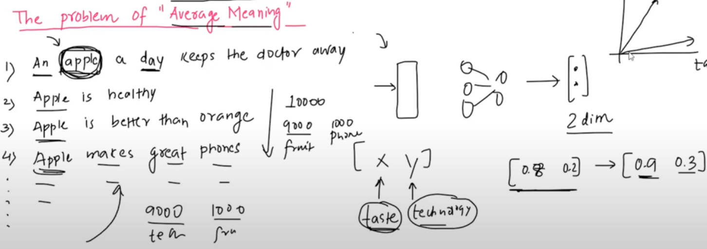
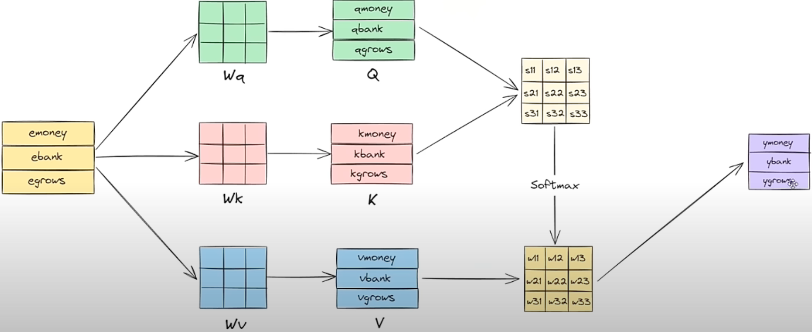
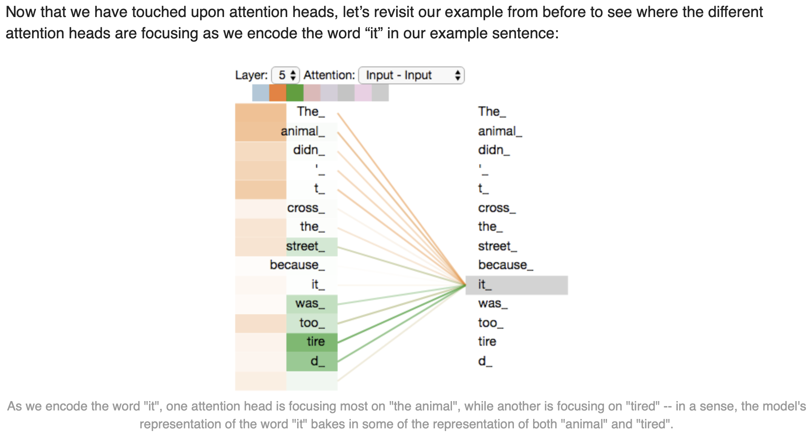
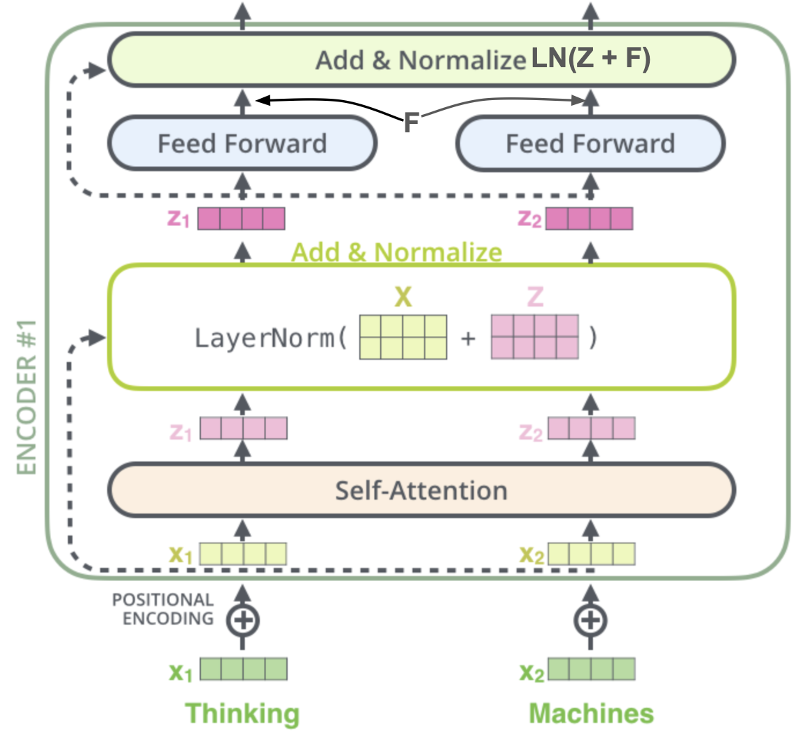

# Disadvantages
- [watch this section](https://youtu.be/BjRVS2wTtcA?t=3030&si=FdujH4Uel7TXPGim)

# Introduction
## Problems With Static Word Embeddings
- A word can have different meanings.
    - apple: fruit, company.
- Embeddings will be formed from the dataset.
- the dataset may contain meaning-imbalance.
    - more samples could exist using the word in its first meaning than other meaning(s).
    - this would cause features(in the total embedding space) that represent that particular meaning to be of way higher value compared to those features that form other meanings.
    - 
    - observe the higher contribution(value) of the *taste* feature than the *technology* feature.
- now if on a test dataset, if for many samples another meaning of the word is used, then the embedding generated will provide **incorrect contextual information** to the Seq2Seq architecture.
    - the model will think that *apple* is still being referred to as a fruit, but the test-dataset could be on characteristics of the apple company.
- Hence, **embeddings** need to be **contextual** inorder to pass correct contextual+semantical information to the model.

# Capturing *Contextual* Word Embeddings

## Introduction
- Whatif word embeddings are calculated for each sentence?
    - this is intuitive because the sentence would tell us in what context is the word used.
    - Take the case of the sentences: "Apple is a delicious fruit." and "Apple makes the best smartphones."
    - the other tokens present in the sentence tell us which meaning of the word *apple* is used.
- assume static embeddings of the tokens as $e_{apple}, e_{is}, \cdots e_{makes}, e_{the}, \cdots e_{smartphones}$
- define contextual embeddings as:
    - for sentence-1: $y_{apple} = wt_1.e_{apple} + wt_2.e_{is} + wt_3.e_{a} + wt_4.e_{delicious} + w_5.e_{fruit}$
    - similarly, for sentence-2: $y_{apple} = \sum\limits_{i=apple}^{smartphones}wt'_i.e_i$
- if we let $wt_1 = e_{apple}.e^T_{apple}, wt_2 = e_{apple}.e^T_{is} \cdots wt_5 = e_{apple}.e^T{fruit}$, now the weights make logical sense.
    - compare this with weights for apple w.r.t. the 2$^{nd} sentence.
    - w.r.t. features in the embeddings that capture eatable vs tech based information,
        - eatable-features-strength(1$^{st}$ sentence) = $wt_5.e_{fruit, eatable} + wt_1.e_{apple, eatable}$, whereas eatable-features-strength(2$^{nd}$ sentence) = $wt_1.e_{apple, eatable}$, because logically the static embedding for smartphones won't have higher contributions from eatable-based features.
        - similarly, tech-features-strength(1$^{st}$ sentence) = $wt_1.e_{apple, tech}$, whereas tech-features-strength(2$^{nd}$ sentence) = $wt_1.e_{apple, tech} + wt_5.e_{smartphones,tech}$, because logically the static embedding for fruit won't have higher contributions from tech-based features.
        - hence, this has made contextual embedding of the same word apple different in both sentences.
- these *weights* are called *attention scores*.

## Concept of Query, Key and Value Vectors

### Intuition
- suppose you're searching for a job online
- you have your profile, a company/opening has their profile, and in case of a match, you are assessed to see how fit you are for that role.
- while searching, you would know what you're searching for, mainly a job profile and not a candidate profile
    - hence *search*(job profile) would be different from *query*(yourself).
- likewise, when the company/opening-profile is querying the database, they would be searching something they themselves aren't(candidate profile, and not a job profile).
- when a match is found, *your value* will decide the strength of the match. and your value(the idea/meaning/contents) is way different from a candidate/opening profile.
- hence, in either scenario, when a particular *user* is *querying*, that is different from when they are being *searched* for, and completely different from what *value* they possess post *match finding*.

## Problem with earlier definition of Contextual Embeddings
- the manner of defining contextual embeddings has 1 flaw: all query,search,value vectors are the same for the same word.
    - when *apple* is being searched for vs when its *querying* vs when its *value* is being used to compute contextual embedding for itself/other tokens, all cases use the same static $e_{apple}$
    - query-vector: when weights are being found to find the contextual embedding of this token.
    - search-vector: when weights are being computed using the embeddings of this token.
    - value-vector: when weights are being used with the embeddings of this token to find contextual embeddings of this/some other token.
- similar to the example discussed in Intuition section, a word should have 3 possibly distinct representations as per the usage:
    - query-vector: as a query
    - search-vector: when being searched
    - value-vector: whose value is used to generate contextual embedding for some token.

## Solution -  Self Attention
- Have 3 possibly different matrices: $W_q, W_s, W_v$
- w.r.t. our apple example($1^{st}$ sentence):
    - $q_{apple} = (e_{apple})_{1\times d}(W_q)_{d\times o}$
    - $s_{apple} = (e_{apple})_{1\times d}(W_s)_{d\times o}$
    - $v_{apple} = (e_{apple})_{1\times d}(W_v)_{d\times o}$
    - similary query,search and value vectors will be generated for other tokens.
    - $w'_i = q_{apple}.s_{i^{th} token}^T, wt_i = \frac{exp^{w'_i}}{\sum\limits_{i=apple}^{fruit}exp^{w'_i}}$, i.e. once dot-products are computed, we use softmax for normalizing *similarity* found.
    - $y_{apple} = \sum\limits_{i=apple}^{fruit}wt_i.v_{i^{th} token}$
- for each sentence, this can be represented in a matrix-multiplication manner:
    - vertically stack all static embeddings of all tokens of a sentence in the same order as that in the sentence($sl \times d$).
    - multiply with 3 matrices to obtain the corresponding query,search,value vector representations($sl \times o$).
    - compute $QK^T$ followed by row-wise softmax computations($sl \times sl$)
    - Extra Steps: 
        - **Before softmax computation**, although the variance of Q and K individually could be lower, that of the matrix-product could be higher. Hence we divide the result by $\sqrt{d_K}$, where $d_K$ is the dimension of the key-vectors.
        - Post scaling, a bias term is also added, making the entire operation: $softmax.\left(\dfrac{QK^T}{\sqrt{d_K}} + Bias \right)$
    - use $(SV)_{sl \times o}$ to obtain the contextual embeddings.
    - 
- This can be for multiple sentences at the same time(parallelization).
- As for the what these **matrices will be**, these are treated as **trainable parameters**.

## Multi-Head Attention
- in the actual paper: Attention is all you need, multiple query,key,value matrices are used.
- now all these $n_h\times 3$ matrices need to be initialized to random, distinct values or else they might be learnt to be the same matrices, losing the point of multi-headed attention.

### Intuition
- Imagine you're planning a surprise birthday party for a friend, and you need to coordinate various aspects like decorations, food, and entertainment. 
- Each aspect requires attention, but they're all interconnected. 
- Multi-headed attention in a transformer is like having multiple organizers, each focusing on a different aspect of the party.
- For instance, one head might focus on coordinating decorations, ensuring everything from balloons to streamers fits the theme. 
- Another head could concentrate on food, making sure there's a variety of snacks and drinks. 
- Yet another head might handle entertainment, organizing games and music.
- By having multiple heads, each specializing in a different aspect, the overall coordination becomes more efficient. 
- They can attend to their specific tasks in parallel, ensuring that every detail is well-managed. 
- Just like in the transformer model, where each head attends to different parts of the input sequence, the multi-headed attention mechanism enables the model to capture various patterns and relationships simultaneously, leading to a more comprehensive understanding of the data.

### Relevance to a sentence
- consider the sentence: "The cat chased the mouse."
- In multi-headed attention, each head can focus on different aspects of the sentence. For example:
    - One head might focus on the relationship between "cat" and "chased," capturing the action being performed.
    - Another head might attend to the relationship between "cat" and "mouse," capturing the subject-object relationship.
    - A third head might concentrate on the entire context of the sentence, capturing the overall meaning and coherence.
- 

### Concatenated Heads
- lets say $n_H=3$, then each word would have 3 contextual embeddings.
- these are horizontally stacked, creating an $sl\times (o.n_H)$ matrix, n: sentence length
- this tends to be longer horizontally, hence is multiplied with a common matrix $W^O$ to generate a single matrix per sentence, in order to:
    - reduce dimensionality
    - combine information(features) learnt across multiple heads

## Positional Encoding
- until now we have captured contextual information in the embedding.
- but the sequential information(timestep/time-signal), i.e. word-x appears n-words before/after word-y is still not present in the data.
- positional encoding is such that the euclidean distance between nearer words is smaller, and farther words is larger.
- for a given word at position *`pos`* within a sequence, the vector is generated as follows:
    - the positional encoding of this word will have the same dimensionality *`d`* as that of the static word embedding of this word
    - the *`i`*'th element of the positional vector is given by :
        - $sin\left(\frac{pos}{10000^{2i/d}}\right)$ , if `i` is even.
        - $cos\left(\frac{pos}{10000^{2i/d}}\right)$ , if `i` is odd.
        - **`i` starts from 0**
- refer to the notebook [positionalEncoding.ipynb](positionalEncoding.ipynb) to see how this encoding makes sense.
- The positional vectors per word are added to their respective static word embeddings, before being sent into the self attention layer of the encoder.
- **WHY?:** The intuition here is that adding these values to the embeddings provides meaningful distances between the embedding vectors once they’re projected into Q/K/V vectors and during dot-product attention.
- Positional Encodings are **only calculated at the first encoder**, and then **used at every other encoder**, i.e. **addition with output-vectors of previous layer**.

# Feed-forward NN and Residuals
- the contextual embeddings generated from self-attention layer are passed into a FFNN
    - this is just like passing a feature matrix into an NN, which will end up learning patterns within those features.
    - patterns could be grammar, syntax, semantic relationships between certain tokens(man,woman  king,queen semantic-similarity).
    - it might learn to predict the next word in a sentence based on the context provided by the preceding words.
- Each sub-layer has a residual connection followed by a layer-normalization step.
    - 
    - The generic advantages of residuals is why they are used:
        - facilitate the flow of gradients during training, that helps alleviate the vanishing gradient problem.
        - allows retention of the original input information/features learnt in previous layers, at each layer, which could've been lost while pushing this data through multiple subsequent layers.
        - because of these 2, now deeper NNs can be formed.

## LayerNorm
- Since we now have a *feature matrix*(for an input sequence), each feature, i.e. column, needs to be normalized before sending to the FFNN.
- Steps
    - Batchify the matrix.
    - for each column, compute $\bar{x}, s^2$(sample mean, sample variance)
    - apply for each column: $LN = \gamma \dfrac{x-\bar{x}}{s} + \beta$, where **$\gamma, \beta$ are learnable scale,shift params, unique to each column(feature)**.

# Decoder - Self Attention
- same as that of encoder attention, decoder inputs = **positionally encoded** target **static embeddings**.
- only difference: words after the current word shouldn't be used to find its contextual embeddings, hence the matrix multiplication $QK^T$ undergoes a masking transformation as well:
    - $Q = \begin{bmatrix} \cdots & q_1 & \cdots \\ \cdots & q_2 & \cdots \\ \cdots & q_3 & \cdots \\ \cdots & q_4 & \cdots \\ \end{bmatrix}_{4\times d}, K = \begin{bmatrix} \cdots & k_1 & \cdots \\ \cdots & k_2 & \cdots \\ \cdots & k_3 & \cdots \\ \cdots & k_4 & \cdots \\ \end{bmatrix}_{4\times d}$, for a decoder we ideally need this matrix $\begin{bmatrix} q_1.k_1 & 0 & 0 & 0 \\ q_2.k_1 & q_2.k_2 & 0 & 0 \\ q_3.k_1 & q_3.k_2 & q_3.k_3 & 0 \\ q_4.k_1 & q_4.k_2 & q_4.k_3 & q_4.k_4 \end{bmatrix}$, but $Q.K^T = \begin{bmatrix} q_1.k_1 & q_1.k_2 & q_1.k_3 & q_1.k_4 \\ q_2.k_1 & q_2.k_2 & q_2.k_3 & q_2.k_4 \\ q_3.k_1 & q_3.k_2 & q_3.k_3 & q_3.k_4 \\ q_4.k_1 & q_4.k_2 & q_4.k_3 & q_4.k_4 \end{bmatrix}$
    - **Observe** that we need to **mask** the **upper triangular** region of the $QK^T$ matrix. this can be done using `np.tril(Q.dot(K.T))`.
    - Now $(Q.K^T).V = \begin{bmatrix} \cdots & v_1(q_1.k_1) & \cdots \\ \cdots & v_1(q_2.k_1)+v_2(q_2.k_2) & \cdots \\ \cdots & v_1(q_3.k_1) + v_2(q_3.k_2) + v_3(q_3.k_3) & \cdots \\ \cdots & v_1(q_4.k_1) + v_2(q_4.k_2) + v_3(q_4.k_3) + v_4(q_4.k_4) & \cdots \end{bmatrix}_{4\times d}$
    - **Note:** The $QK^T$ is *scaled + softmaxed*(division by $\sqrt{d_K}$) before multiplying with the value-vectors V.
- this again **is multi-headed**(different $W_q, W_k, W_v$ s.t. different $Q, K, V$ are obtained), **has residuals** with the positional encodings of the input decoder sequence.

# Decoder - Encoder-Decoder Attention
- Layer-normalised output vectors from the self-attention sublayer of **every decoder** undergoes **attention with** the **key-value vectors from** the **last encoder**.
- The computations are the same for every $i^{th}$ decoder: 
    1. Attention score computation($Q_{dec^i}K_{enc^{n_e}}$) 
    2. Scaling + softmax 
    3. Multplication with $V_{enc^{n_e}}$
    - $n_e$: total number of encoders.
- this again **is multi-headed**(different $W_q, W_k, W_v$ s.t. different $Q, K, V$ are obtained), **has residuals** with the masked-multi-headed attention(self-attention) in the preceding sub-layer.

# Decoder - FFNN
- encoder-decoder vectors are passed here.
- this has residuals with the vectors passed into it as well.

# Linear + Softmax layers + Loss Computation

## Lineary Layer
- the linear layer is responsible for expanding dimensions, i.e. $ sl_{dec} \times d \rightarrow sl_{dec} \times vocab_{target}$

## Softmax Layer
- this matrix is rowwise-softmaxed to yield another $sl_{dec} \times vocab_{target}$ matrix , where each row determines the probability distribution per token of the target vocabulary.

## Loss Computation
- for the $j^{th}$ position token in the decoder target sequence, assuming this token is $l^{th}$ in the target vocabulary, then loss at this position is given by the natural log of $l^{th}$ element of the $j^{th}$ row of the softmax matrix output.
- the total loss for this input-output sequence pair is (summation of loss over each position)/(target sequence length).

# Inference step
- Timestep-1: decoder input = embedding of `<sos>` token.
- Once the output token is generated(greedy decoding: take the highest probability token from timestep-1, *some other decoding technique* can also be used), its static encoding is vertically stacked with that of `<sos>` and run through the decoder again.
    - This happens till `<eos>` is output.
- **Note:** For further timesteps, there will be no need to run through the encoder, since its key-value vectors generated in timestep-1 can be used.
- Another decoding(sampling) technique: Beam Search (top b subsequences kept instead)
- **Note:** Sampling technique in training and inference needs to be identical.

## Sampling Techniques
1. Random sampling(`np.random.choice`)
2. Top-K sampling
    1. select K most likely tokens, put their probabilities in a separate array.
    2. normalize(scale-up) their probabilities so that they add to 1.
    3. use this prob. distro. in `np.random.choice` to select 1 token at random.
3. 

# [AI / ML / LLM / Transformer Models Timeline and List](https://ai.v-gar.de/ml/transformer/timeline/index.html)